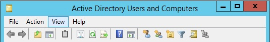
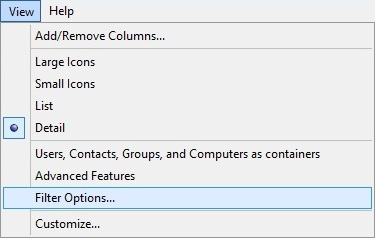
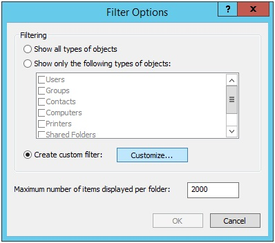
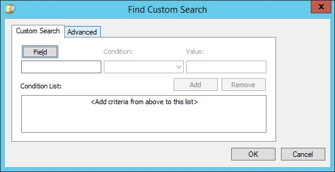
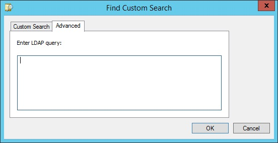

# User filter

How to __filter users__ based on the criteria *enabled* or *disabled*

## Active Directory Users and Computers

1. Menu: "View"

2. Select: "Filter Options..."

3. Choose: "Create custom filter" and Click: "Customize..."

4. Select tab: "Advanced"

5. Write: "Enter LDAP query:" (text in the subsections below)

6. Click: "OK"
7. Click: "OK"

### Enabled users

    (!UserAccountControl:1.2.840.113556.1.4.803:=2)

### Disabled users

    UserAccountControl:1.2.840.113556.1.4.803:=2

Inspitarion for this guide took from [here](https://social.technet.microsoft.com/Forums/windowsserver/en-US/44048e98-b191-4d18-9839-d79ffad86f76/ldap-query-for-all-active-users?forum=winserverDS)
